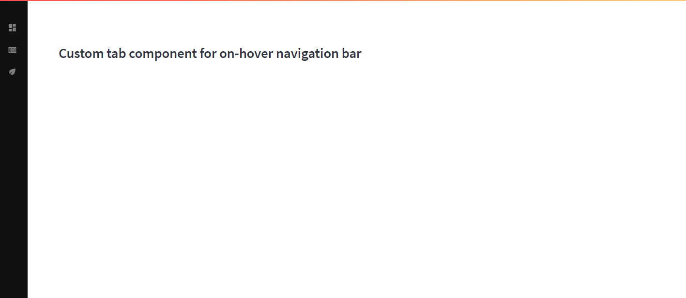

# streamlit-on-Hover-tabs
Custom tabs for on hover streamlit navigation bar created by custom css



on-hover-tabs is a component meant for a custom navigation bar like the above created via custom CSS. The CSS is also included in the repository. 
- Its possible to chose custom icons which is enable via https://fonts.google.com/icons
- Currently, its not yet possible to adjust the CSS of the tabs component via the python code, will work on it in the coming weeks
- Plans to also adjust the sidebar via the python code is also in the works (like colour etc, but you can enter into the style css and do this yourself)

Its build on the [streamlit custom components typescript template](https://github.com/streamlit/component-template)

To install it:
```
pip install streamlit-on-Hover-tabs
```

**Variables**

- name: This is the name of the tab
- iconName: This is the name of the icon you wish to use in the sidebar

Examples:

```
from st_on_hover_tabs import on_hover_tabs
import streamlit as st
st.set_page_config(layout="wide")

st.header("Custom tab component for on-hover navigation bar")
st.markdown('<style>' + open('./style.css').read() + '</style>', unsafe_allow_html=True)


with st.sidebar:
    tabs = on_hover_tabs(name=['Dashboard', 'Money', 'Economy'], 
                         iconName=['dashboard', 'money', 'economy'])

if tabs =='Dashboard':
    st.title("Navigation Bar")
    st.write('Name of option is {}'.format(tabs))

elif tabs == 'Money':
    st.title("Paper")
    st.write('Name of option is {}'.format(tabs))

elif tabs == 'Economy':
    st.title("Tom")
    st.write('Name of option is {}'.format(tabs))
    
```


